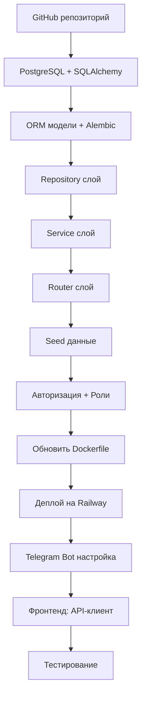

# План работ: «ТРУД Mini App» — Архитектура и Деплой

## Контекст

- **Цель:** демо для владельца кофейни, где вы работаете
- **Бюджет:** $5/мес на Railway (хватит на PostgreSQL + app)
- **Деплой:** Railway + GitHub
- **Дизайн:** будет отдельно, после архитектуры (у вас есть prompt)
- **Споты:** не нужны, одна точка

---

## Этап 1: GitHub + локальная подготовка

### 1.1 Создать репозиторий на GitHub
- Название: `trud-miniapp` (или другое)
- Приватный репозиторий
- Добавить `.gitignore` для Python + Node

### 1.2 Перенести проект в Git
```bash
git init
git add .
git commit -m "init: MVP from codex"
git remote add origin git@github.com:ваш-username/trud-miniapp.git
git push -u origin main
```

---

## Этап 2: Backend — PostgreSQL + слоистая архитектура

### 2.1 Добавить зависимости

**Файл:** [`backend/requirements.txt`](backend/requirements.txt)

```
fastapi==0.116.0
uvicorn[standard]==0.35.0
httpx==0.28.1
python-dotenv==1.1.1
pydantic-settings>=2.0.0
sqlalchemy[asyncio]>=2.0.0
asyncpg>=0.30.0
alembic>=1.14.0
boto3>=1.35.0
python-multipart>=0.0.12
```

### 2.2 Создать config.py

**Файл:** [`backend/app/config.py`](backend/app/config.py)

```python
from pydantic_settings import BaseSettings

class Settings(BaseSettings):
    database_url: str = "postgresql+asyncpg://localhost:5432/trud"
    bot_token: str = ""
    public_base_url: str = ""
    web_app_url: str = ""
    webhook_secret: str = "trud-local-dev"
    cors_origins: str = "*"
    
    model_config = {"env_prefix": "TRUD_"}

settings = Settings()
```

### 2.3 Переписать database.py на SQLAlchemy async

**Файл:** [`backend/app/database.py`](backend/app/database.py)

```python
from sqlalchemy.ext.asyncio import create_async_engine, async_sessionmaker, AsyncSession
from app.config import settings

engine = create_async_engine(settings.database_url, echo=False)
async_session = async_sessionmaker(engine, class_=AsyncSession, expire_on_commit=False)

async def get_db() -> AsyncSession:
    async with async_session() as session:
        yield session
```

### 2.4 Создать ORM модели

**Файлы:** `backend/app/models/`

- `item.py` — Item ORM модель
- `brew_bar_recipe.py` — BrewBarRecipe ORM модель
- `batch_brew_recipe.py` — BatchBrewRecipe ORM модель
- `signature_ttk.py` — SignatureTtk ORM модель
- `brew_history.py` — BrewHistory ORM модель
- `user.py` — User ORM модель (новая, для ролей)

### 2.5 Создать Pydantic схемы

**Файлы:** `backend/app/schemas/`

- `item.py` — ItemCreate, ItemUpdate, ItemResponse
- `brew_bar.py` — BrewBarCreate, BrewBarUpdate (partial!), BrewBarResponse
- `batch_brew.py` — BatchBrewCreate, BatchBrewUpdate, BatchBrewResponse
- `signature_ttk.py` — SignatureTtkCreate, SignatureTtkUpdate, SignatureTtkResponse
- `brew_history.py` — BrewHistoryCreate, BrewHistoryResponse
- `calculation.py` — CalculationRequest, CalculationResponse

**Важно:** `BrewBarUpdate` и аналогичные должны быть partial (все поля Optional).

### 2.6 Создать Repository слой

**Файлы:** `backend/app/repositories/`

Каждый репозиторий — класс с методами CRUD, работающий через `AsyncSession`.

```python
class ItemRepository:
    def __init__(self, session: AsyncSession):
        self.session = session
    
    async def list(self, category: str | None = None) -> list[Item]:
        ...
    
    async def get(self, item_id: str) -> Item | None:
        ...
    
    async def create(self, data: dict) -> Item:
        ...
    
    async def update(self, item_id: str, data: dict) -> Item | None:
        ...
    
    async def delete(self, item_id: str) -> bool:
        ...
```

### 2.7 Создать Service слой

**Файлы:** `backend/app/services/`

Сервисы содержат бизнес-логику и оркестрируют репозитории.

```python
class ItemService:
    def __init__(self, repo: ItemRepository):
        self.repo = repo
    
    async def list_items(self, category: str | None = None) -> list[ItemResponse]:
        items = await self.repo.list(category)
        return [ItemResponse.model_validate(item) for item in items]
```

### 2.8 Создать Router слой

**Файлы:** `backend/app/routers/`

Тонкие роутеры, которые принимают HTTP-запрос, вызывают сервис, возвращают ответ.

```python
from fastapi import APIRouter, Depends
from sqlalchemy.ext.asyncio import AsyncSession
from app.database import get_db
from app.services.item_service import ItemService
from app.repositories.item_repository import ItemRepository

router = APIRouter(prefix="/api/items", tags=["items"])

@router.get("")
async def list_items(category: str | None = None, db: AsyncSession = Depends(get_db)):
    service = ItemService(ItemRepository(db))
    return await service.list_items(category)
```

### 2.9 Инициализировать Alembic

```bash
cd backend
alembic init alembic
# настроить alembic.ini на database_url
alembic revision --autogenerate -m "initial"
alembic upgrade head
```

### 2.10 Перенести seed-данные

**Файл:** `backend/app/seed/__init__.py`

Функция `seed_database()`, которая заполняет БД начальными данными при первом запуске.

### 2.11 Исправить PATCH-эндпоинты

Заменить использование полных Payload-моделей на partial Update-модели во всех PATCH-роутах.

---

## Этап 3: Авторизация + Роли

### 3.1 Модель User

```python
class User(Base):
    __tablename__ = "users"
    id: Mapped[str] = mapped_column(primary_key=True, default=uuid4)
    telegram_id: Mapped[int] = mapped_column(unique=True, nullable=False)
    first_name: Mapped[str] = mapped_column(default="")
    role: Mapped[str] = mapped_column(default="barista")  # owner, barista, pastry_chef
    is_active: Mapped[bool] = mapped_column(default=True)
    created_at: Mapped[str] = mapped_column(default=now_iso)
```

### 3.2 Auth dependency

**Файл:** `backend/app/auth/dependencies.py`

```python
from fastapi import Header, HTTPException, Depends
from app.telegram.auth import verify_init_data

async def get_current_user(x_telegram_init_data: str = Header(...)):
    user_data = verify_init_data(x_telegram_init_data)
    if not user_data:
        raise HTTPException(status_code=401, detail="Invalid Telegram auth")
    return user_data

async def require_role(role: str):
    async def role_checker(current_user = Depends(get_current_user)):
        if current_user.get("role") != role:
            raise HTTPException(status_code=403)
        return current_user
    return role_checker
```

### 3.3 Фронтенд: передача initData

В `api/client.ts` добавить перехватчик, который добавляет заголовок `X-Telegram-Init-Data` из Telegram WebApp.

---

## Этап 4: Railway + Деплой

### 4.1 Обновить Dockerfile

```dockerfile
FROM node:24-slim AS frontend
WORKDIR /app/frontend
COPY frontend/package*.json ./
RUN npm ci
COPY frontend ./
RUN npm run build

FROM python:3.14-slim
ENV PYTHONDONTWRITEBYTECODE=1
ENV PYTHONUNBUFFERED=1
WORKDIR /app

COPY backend/requirements.txt ./backend/requirements.txt
RUN pip install --no-cache-dir -r backend/requirements.txt

COPY backend ./backend
COPY --from=frontend /app/frontend/dist ./frontend/dist

EXPOSE 8000
CMD alembic upgrade head && uvicorn app.main:app --host 0.0.0.0 --port ${PORT:-8000} --app-dir backend
```

**Важно:** Добавить `alembic upgrade head` в CMD, чтобы миграции применялись при старте.

### 4.2 Railway PostgreSQL

В Railway добавить PostgreSQL plugin — он даст `DATABASE_URL`.

### 4.3 Переменные окружения на Railway

| Variable | Значение |
|---|---|
| `TRUD_DATABASE_URL` | `postgresql+asyncpg://...` (из Railway PostgreSQL) |
| `TRUD_BOT_TOKEN` | Токен от @BotFather |
| `TRUD_PUBLIC_BASE_URL` | `https://trud-miniapp.up.railway.app` |
| `TRUD_WEBHOOK_SECRET` | Случайная строка |
| `TRUD_CORS_ORIGINS` | `*` |

### 4.4 Telegram Bot

1. Создать бота через @BotFather
2. Установить команды: `/start` — открыть базу бара
3. После деплоя бот сам установит webhook (логика уже есть в `configure_telegram()`)

---

## Этап 5: Фронтенд (базовый рефакторинг)

### 5.1 Выделить API-клиент

**Файл:** `frontend/src/api/client.ts`

```typescript
import { getTelegramApp } from "../telegram";

const API_BASE = import.meta.env.VITE_API_URL ?? "";

export class ApiError extends Error {
  constructor(public status: number, message: string) {
    super(message);
  }
}

export async function apiRequest<T>(path: string, options?: RequestInit): Promise<T> {
  const headers: Record<string, string> = {
    "Content-Type": "application/json",
    ...(options?.headers as Record<string, string>),
  };
  
  const tg = getTelegramApp();
  if (tg?.initData) {
    headers["X-Telegram-Init-Data"] = tg.initData;
  }
  
  const response = await fetch(`${API_BASE}${path}`, { ...options, headers });
  
  if (!response.ok) {
    const error = await response.json().catch(() => ({}));
    throw new ApiError(response.status, error.detail || "Request failed");
  }
  
  return response.json();
}
```

### 5.2 Зафиксировать версии зависимостей

Заменить `"latest"` на конкретные версии в `package.json`.

---

## Порядок выполнения



---

## Что НЕ входит в этот этап

- Дизайн-доработки (будут отдельно по вашему prompt)
- S3/R2 для загрузки фото (можно добавить позже)
- Админ-раздел (после продажи владельцу)
- E2E тесты (можно добавить после дизайна)